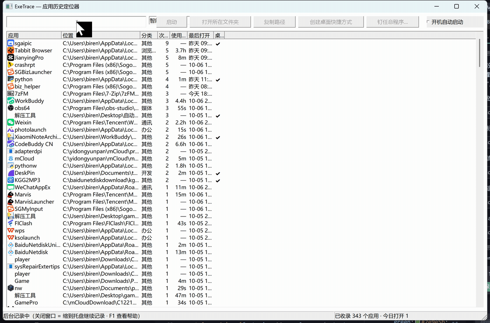
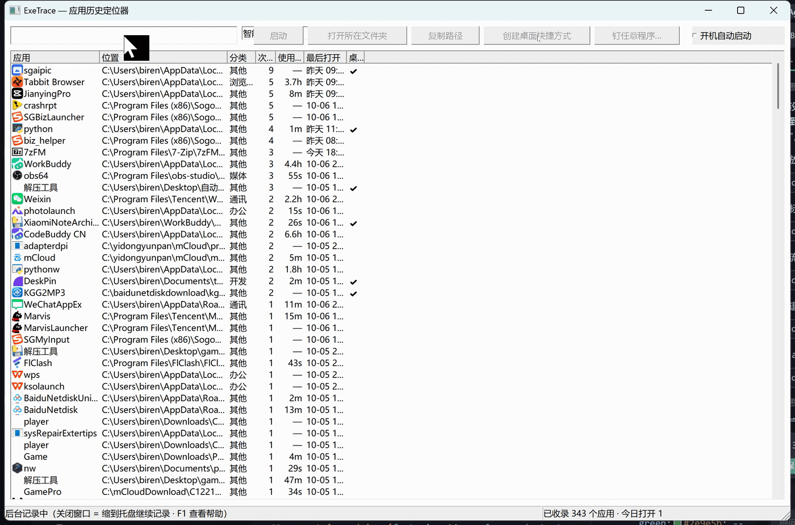
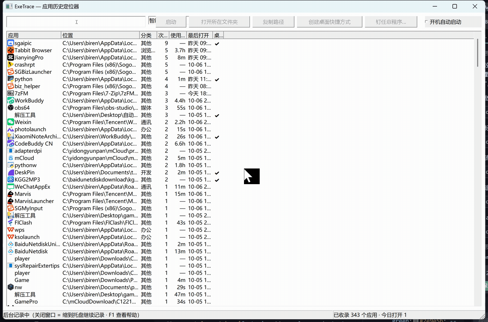
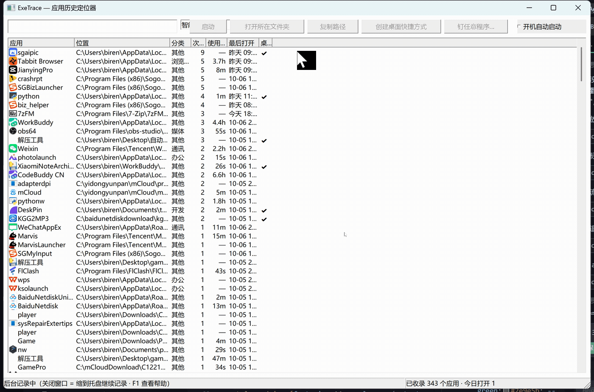
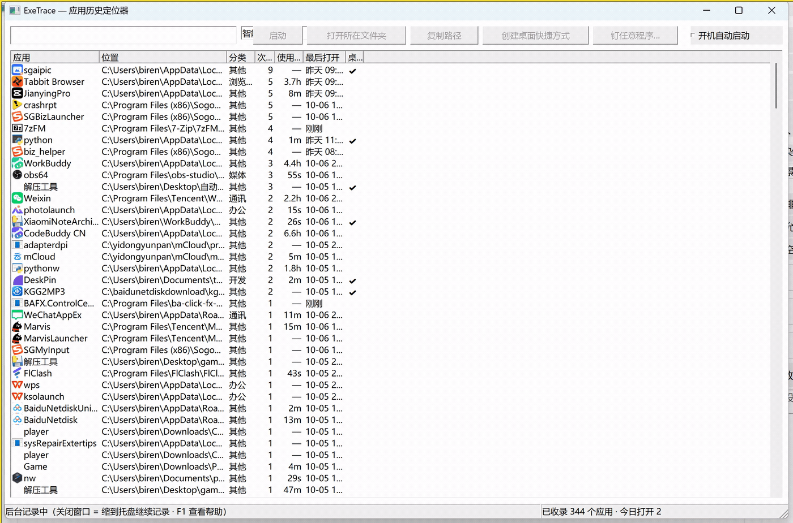
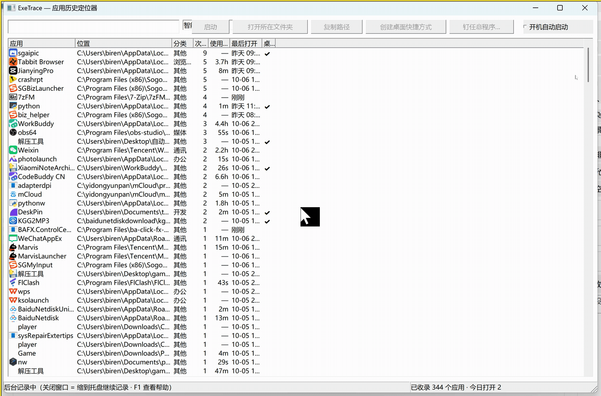

# ExeTrace 功能演示

> 本文档中的每一张动图都是**真实操作录制**（真实鼠标、真实点击、真实反馈），
> 不是效果图或摆拍。录制脚本见 `tools/demo_record.py`（可复现，任何人都能重录）。

---

## 它解决什么问题

你有没有过这种时刻：

- 上周用一个小工具处理了张图片，现在想再用一次，**名字记不起来了**；
- 从开始菜单里翻了三层，才找到一个其实天天用的程序；
- 装完某软件，桌面多了一堆图标，**其实你只想要一个**。

ExeTrace 做三件事：**记住你打开过的一切** · **一秒找回来** · **一键钉到桌面**。

它常驻系统托盘（约 8 MB 内存），默默记录你启动过的每个应用——不论你是从桌面快捷方式、
开始菜单还是命令行打开的。关掉界面它仍在后台工作；需要时按 `Ctrl+Alt+E` 随时呼出。

---

## 1. 搜索：从几百个应用里一秒找到



**在做什么**：在搜索框输入 `chrome`，列表实时过滤出所有相关应用，按 `Esc` 一键复原。

- 输入即筛，不需要回车、不需要等
- 匹配范围包含**应用名**和**完整路径**——想不起来名字时，输入项目目录名也能找到
- 小贴士：`Ctrl+F` 可以在任何位置直接跳到搜索框（并全选，输入即替换）

---

## 2. 双击启动：找回来，就顺手打开



**在做什么**：搜索定位到 7-Zip，**双击**列表项，程序被真实启动。

- 双击 = 启动；单击 = 选中（可再配合底部按钮做其它操作）
- 列表里的应用按「智能排序」排列：**经常用 + 最近用**的自动浮到前面
  （排序公式是 frecency：`打开次数 × e^(-距今天数/30)`，30 天为一个半衰期）
- 想换排序方式？顶部下拉可切换：智能排序 / 最近打开 / 打开次数 / 名称

---

## 3. 右键菜单：启动、定位、复制、钉桌面，一个都不少



**在做什么**：右键任意一行，用方向键选中「复制完整路径」，状态栏立刻给出反馈。

右键菜单包含：

| 菜单项 | 作用 |
|---|---|
| 启动 | 打开这个应用 |
| 打开所在文件夹 | 在资源管理器中定位到该 exe |
| 复制完整路径 | 复制 exe 的完整路径到剪贴板 |
| 创建桌面快捷方式 | 把这个应用钉到桌面（同名自动编号，绝不覆盖） |
| 从历史中移除 | 从记录里删除这一条 |
| 清理失效记录 | 一次性清理掉所有已被卸载/移动的程序 |
| 暂停记录 | 临时停止记录（比如你在做隐私敏感的事） |
| 帮助 (F1) | 打开帮助面板（含完整快捷键表） |

---

## 4. 一键钉到桌面：把「刚找回的程序」变成桌面图标



**在做什么**：选中一行 → 点「创建桌面快捷方式」→ 状态栏确认，列表的「桌面」列打勾。

- 创建的快捷方式带**正确的图标、起始位置和名称**（不是那种打开就报错的裸链接）
- 创建后会**自动读回校验**——校验不通过会明确告诉你，不糊弄
- 同名文件存在时自动编号（`微信 (2).lnk`），**绝不覆盖你桌面上已有的东西**
- 想钉桌面上**还没被记录过**的程序？点「钉任意程序…」，选 exe 或**整个软件文件夹**——
  它会自动识别出该文件夹里的主程序（跳过 setup/uninstall/helper 这类杂物）

---

## 5. 托盘常驻 + 全局热键：不占地方，随时都在



**在做什么**：关闭窗口（它缩进了托盘）→ 在别的地方按 `Ctrl+Alt+E` → 窗口立刻回来且光标已在搜索框里。

- **关闭窗口 ≠ 退出**：关窗只是缩到托盘，记录继续
- **`Ctrl+Alt+E` 全局热键**：在任何程序里都能呼出，呼出即可直接输入搜索
- 真正退出：右键托盘图标 → 退出
- 托盘菜单还可以：暂停记录 / 开关开机自启
- 内存占用（实测）：常驻约 **8 MB**，窗口打开约 3–7 MB

---

## 6. 内置帮助：快捷键全在这里



**在做什么**：打开帮助面板（`F1`，或右键菜单 →「帮助 (F1)」）——功能说明、快捷键表、托盘说明、配置文件格式都在里面。

---

## 附：完整快捷键

| 按键 | 作用 |
|---|---|
| `回车` | 启动选中项（在搜索框里按也一样） |
| `双击` | 启动该应用 |
| `Delete` | 从历史中移除选中项 |
| `Ctrl+C` | 复制选中项路径 |
| `Ctrl+F` | 聚焦搜索框（全选已有内容） |
| `Esc` | 清空搜索（焦点在搜索框时） |
| `F5` | 刷新列表 |
| `F1` | 打开帮助 |
| `Ctrl+Alt+E` | **全局**呼出主窗口（任何程序里都能用） |

---

## 附：配置文件

`%LOCALAPPDATA%\ExeTrace\config.json`（改完自动生效，无需重启）：

```json
{
  "ignore": ["spam-tool.exe"],
  "categories": { "code.exe": "开发" }
}
```

- `ignore`：不想被记录的程序（写文件名或路径片段）
- `categories`：覆盖列表里显示的「分类」列（按 exe 文件名指定）

---

## 复现这些动图

```powershell
# 录制（会独占鼠标键盘约 20 秒/场景，请勿同时操作电脑）
python tools/demo_record.py --list            # 查看全部场景
python tools/demo_record.py --scene 1-search  # 单个场景
python tools/demo_record.py --all             # 全部重录
```

产物：`assets/demo/*.gif`（动图）+ `assets/demo/raw/*.mp4`（中间录像，便于只调 GIF 参数：
`--gif-only`）。
